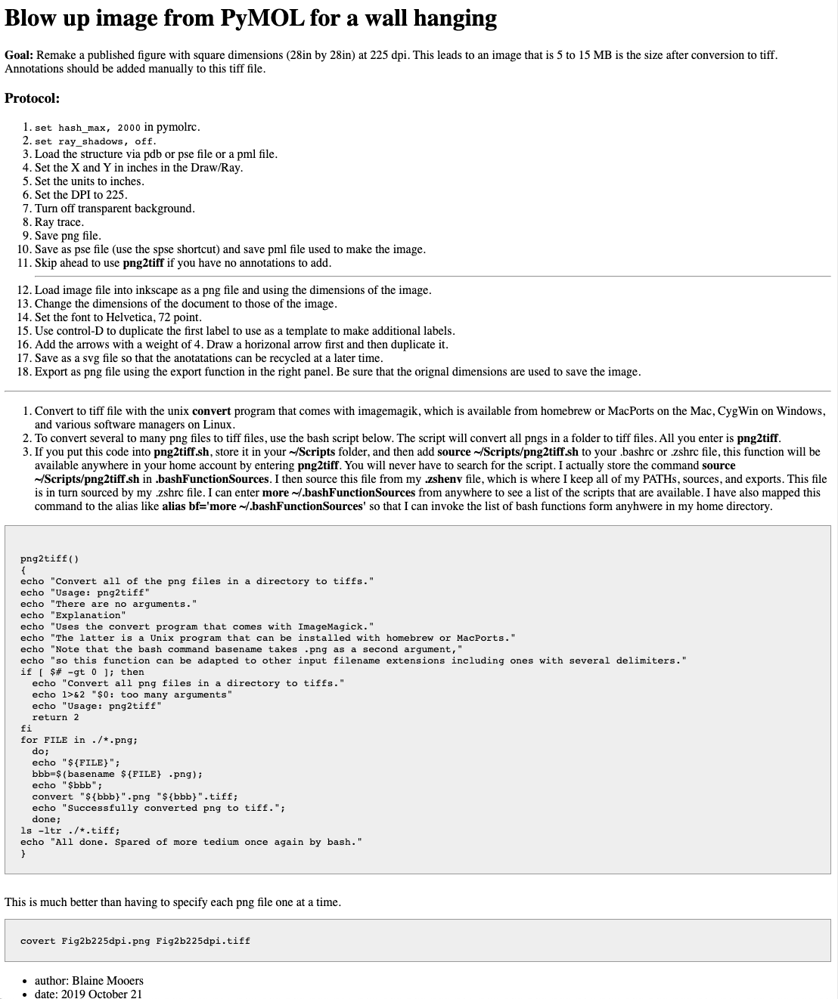

# Protocol for making wall hangings with PyMOL

Protocol for making large scale images to be framed or for background images of posters.

<figure> <figcaption>Snap shot of hmtl file.</figcaption></figure>

## Related Repos

- [easypymol](https://github.com/MooersLab/EasyPyMOL/edit/master/README.md)
- [pymolshortcuts](https://github.com/MooersLab/pymolshortcuts)
- [pymolsnips](https://github.com/MooersLab/pymolsnips)
- [orgpymolpysnips](https://github.com/MooersLab/orgpymolpysnips)
- [rstudiopymolpysnips](https://github.com/MooersLab/rstudiopymolpysnips)
- [taggedpymolpysnips](https://github.com/MooersLab/taggedpymolpysnips)
- [jupyterlabpymolpysnips](https://github.com/MooersLab/jupyterlabpymolpysnips)
- [colabOpenSourcePyMOLpySnips](https://github.com/MooersLab/colabOpenSourcePyMOLpySnips)
- [colabPyMOLpySnips](https://github.com/MooersLab/colabPyMOLpySnips)
